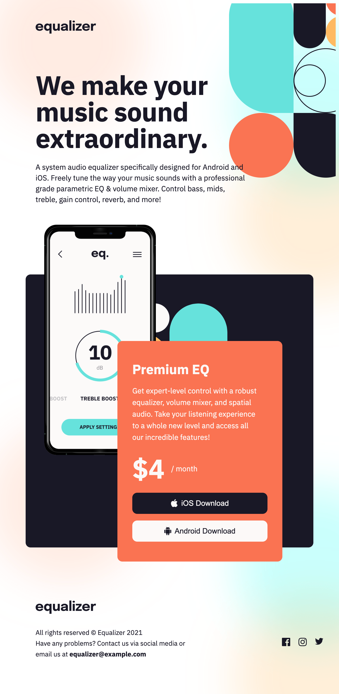

# Frontend Mentor - Equalizer landing page solution

This is a solution to the [Equalizer landing page challenge on Frontend Mentor](https://www.frontendmentor.io/challenges/equalizer-landing-page-7VJ4gp3DE). Frontend Mentor challenges help you improve your coding skills by building realistic projects.

## Table of contents

- [Frontend Mentor - Equalizer landing page solution](#frontend-mentor---equalizer-landing-page-solution)
  - [Table of contents](#table-of-contents)
  - [Overview](#overview)
    - [The challenge](#the-challenge)
    - [Screenshot](#screenshot)
    - [Links](#links)
  - [My process](#my-process)
    - [Built with](#built-with)
    - [Useful resources](#useful-resources)
  - [Author](#author)

## Overview

### The challenge

Users should be able to:

- View the optimal layout depending on their device's screen size
- See hover states for interactive elements

### Screenshot

- Desktop:

  

- Tablet:

  

- Mobile:

  

### Links

- Solution URL: [https://www.frontendmentor.io/solutions/responsive-equalizer-landing-page-flex-grid-css-and-html5-Ivgl5RtYj](https://www.frontendmentor.io/solutions/responsive-equalizer-landing-page-flex-grid-css-and-html5-Ivgl5RtYj)
- Live Site URL: [https://copocaneta.github.io/frontend-projects/equalizer-landing-page/](https://copocaneta.github.io/frontend-projects/equalizer-landing-page/)

## My process

### Built with

- Semantic HTML5 markup
- CSS custom properties
- Flexbox
- CSS Grid
- Mobile-first workflow

### Useful resources

- [HTML5 Semantics](https://css-tricks.com/how-to-section-your-html/) - Fantastic read.
- [Position Elements to the Negative Right Position and Prevent Horizontal Scrollbars](https://impress.org/how-to-position-elements-to-the-negative-right-position-and-prevent-horizontal-scrollbars/) - Pheeew, ended up putting it on a background-image, much easier.
- [Changing Color of SVG on Hover when it's on background-image](https://css-tricks.com/change-color-of-svg-on-hover/) - Ended up using Barrett Sonntag fantastic tool at [codepen](https://codepen.io/sosuke/pen/Pjoqqp).
- [CSS grid-auto-row](https://developer.mozilla.org/en-US/docs/Web/CSS/grid-auto-rows) - Good refreshening.
- [Aligning items on CSS Grid](https://www.joomlashack.com/blog/tutorials/center-and-align-items-in-css-grid/) - Good refreshsing as well.
- [CSS Grid - Line based placement](https://developer.mozilla.org/en-US/docs/Web/CSS/CSS_Grid_Layout/Line-based_Placement_with_CSS_Grid) - Heeey, CSS grid is awesome, don't hate on it.

## Author

- Website - [Thiago Bernardi](https://metabravo.com)
- Frontend Mentor - [@copocaneta](https://www.frontendmentor.io/profile/copocaneta)
- Linkedin - [thiago-bernardi](https://www.linkedin.com/in/thiago-bernardi/)
