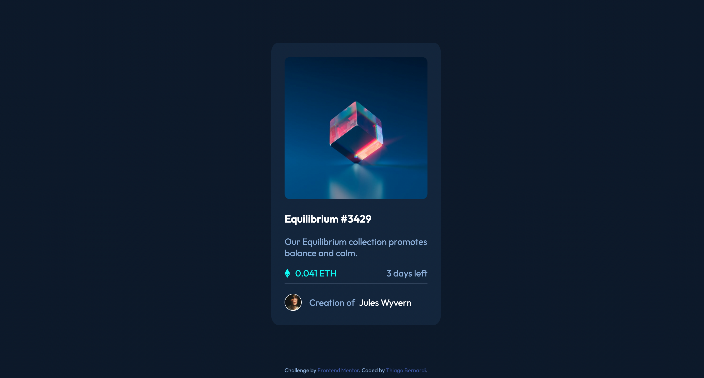
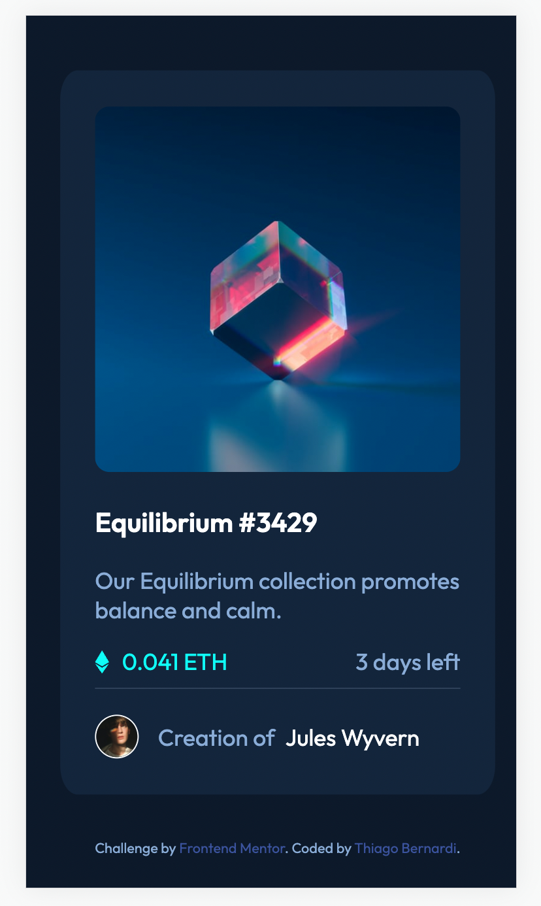

# Frontend Mentor - NFT preview card component solution

This is a solution to the [NFT preview card component challenge on Frontend Mentor](https://www.frontendmentor.io/challenges/nft-preview-card-component-SbdUL_w0U). Frontend Mentor challenges help you improve your coding skills by building realistic projects.

## Table of contents

- [Frontend Mentor - NFT preview card component solution](#frontend-mentor---nft-preview-card-component-solution)
  - [Table of contents](#table-of-contents)
  - [Overview](#overview)
    - [The challenge](#the-challenge)
    - [Screenshot](#screenshot)
    - [Links](#links)
  - [My process](#my-process)
    - [Built with](#built-with)
    - [Useful resources](#useful-resources)
  - [Author](#author)

## Overview

### The challenge

Users should be able to:

- View the optimal layout depending on their device's screen size
- See hover states for interactive elements

### Screenshot

- Desktop:

  

- Mobile:

  

### Links

- Solution URL: [https://www.frontendmentor.io/solutions/responsive-nft-preview-card-component-tXnNEcuFb](https://www.frontendmentor.io/solutions/responsive-nft-preview-card-component-tXnNEcuFb)
- Live Site URL: [https://copocaneta.github.io/frontend-projects/nft-preview-card-component-main/](https://copocaneta.github.io/frontend-projects/nft-preview-card-component-main/)

## My process

### Built with

- Semantic HTML5 markup
- CSS custom properties
- Flexbox
- Mobile-first workflow

### Useful resources

- [CSS Variables](https://www.w3schools.com/css/css3_variables.asp) - For future reference.
- [Rounded images](https://www.w3schools.com/howto/howto_css_rounded_images.asp) - Interesting info.
- [HSL colors](https://www.w3schools.com/colors/colors_hsl.asp)
- [CSS Image Overlay Icon](https://www.w3schools.com/howto/howto_css_image_overlay_icon.asp)
- [Changing the color of hr elements](https://www.tutorialrepublic.com/faq/how-to-change-the-color-of-an-hr-element-using-css.php)

## Author

- Website - [Thiago Bernardi](https://metabravo.com)
- Frontend Mentor - [@copocaneta](https://www.frontendmentor.io/profile/copocaneta)
- Linkedin - [thiago-bernardi](https://www.linkedin.com/in/thiago-bernardi/)
