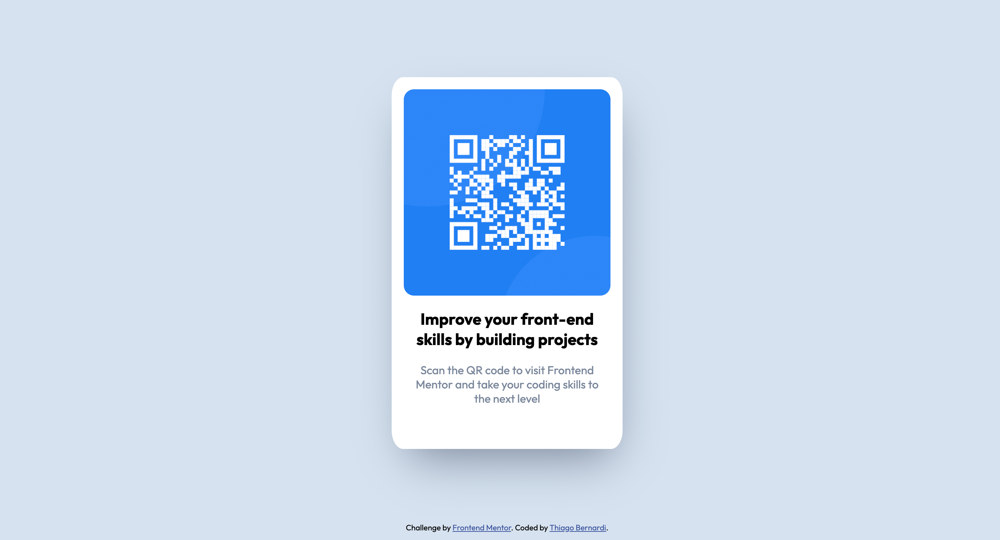

# Frontend Mentor - QR code component solution

This is a solution to the [QR code component challenge on Frontend Mentor](https://www.frontendmentor.io/challenges/qr-code-component-iux_sIO_H). Frontend Mentor challenges help you improve your coding skills by building realistic projects.

## Table of contents

- [Frontend Mentor - QR code component solution](#frontend-mentor---qr-code-component-solution)
  - [Table of contents](#table-of-contents)
  - [Overview](#overview)
    - [Screenshot](#screenshot)
    - [Links](#links)
  - [My process](#my-process)
    - [Built with](#built-with)
    - [Useful resources](#useful-resources)
  - [Author](#author)

## Overview

### Screenshot

- Desktop:

  

- Mobile:

  

### Links

- Solution URL: [https://www.frontendmentor.io/solutions/responsive-qrcode-page-using-plain-html-and-some-flex-css-yskc4441Q](https://www.frontendmentor.io/solutions/responsive-qrcode-page-using-plain-html-and-some-flex-css-yskc4441Q)
- Live Site URL: [https://copocaneta.github.io/frontend-projects/qr-code-component-main/](https://copocaneta.github.io/frontend-projects/qr-code-component-main/)

## My process

### Built with

- Semantic HTML5 markup
- CSS custom properties
- Flexbox

### Useful resources

- [CSS Variables](https://www.w3schools.com/css/css3_variables.asp) - For future reference.
- [Rounded images](https://www.w3schools.com/howto/howto_css_rounded_images.asp) - Interesting info.
- [HSL colors](https://www.w3schools.com/colors/colors_hsl.asp) - I had never used HSL coloring on CSS like this before.

## Author

- Website - [Thiago Bernardi](https://metabravo.com)
- Frontend Mentor - [@copocaneta](https://www.frontendmentor.io/profile/copocaneta)
- Linkedin - [thiago-bernardi](https://www.linkedin.com/in/thiago-bernardi/)
